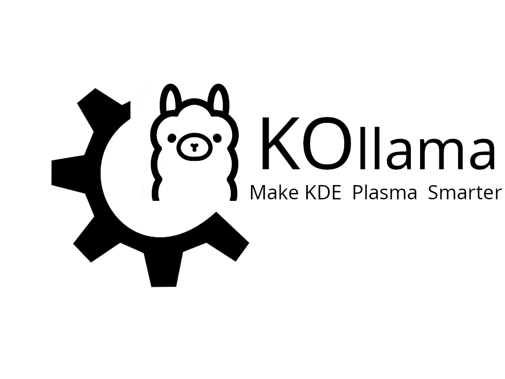

# KOllama



## 介绍

KOllama 是一款为 Ollama 打造的KDE小组件，该组件通过[ChatQT](https://github.com/DenysMb/ChatQT-Plasmoid)二次开发后实现，您可以使用这个小组件与所有下载到本地的 Ollama 模型进行快速对话，即使您的计算机未连接到互联网，您仍然可以正常使用KOllama。

## 使用前的准备

### 1.  安装Ollama

Arch Linux及其衍生版用户可以运行此命令安装Ollama

```bash
sudo pacman -S ollama
```

其他发行版本的用户请使用以下命令安装Ollama

```bash
curl -fsSL https://ollama.com/install.sh | sh
```

### 2. 启动Ollama

```bash
# 启动Ollama服务
sudo systemctl start ollama

# 如果您想在系统启动时自动启动Ollama服务，请运行以下命令
sudo systemctl enable ollama
```
### 3. 安装模型

模型列表详见：https://ollama.com/library

假设您想安装Qwen2模型，您可以运行以下命令
```bash
ollama run qwen2
```

### 安装KOllama小组件

```bash
git clone https://github.com/sengedev/KOllama.git
kpackagetool6 -t Plasma/Applet -i ./KOllama
```
## 使用方法

在使用前，请确保您的Ollama已经安装完成并存在至少一个可用的模型。

1. 添加小组件，将KOllama小组件添加到Plasma Shell或桌面上。

2. 打开KOllama，刷新获取模型列表，然后选择一个模型，例如Qwen2。

3. 启动后您可以直接在KOllama中与模型聊天，在KOllama回答过程中，您可以继续使用您的电脑做其他的事情。

## 注意事项

> 目前KOllama尚不完善，在上游版本更新后我将会同步更新。
